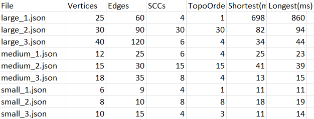
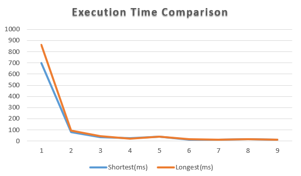
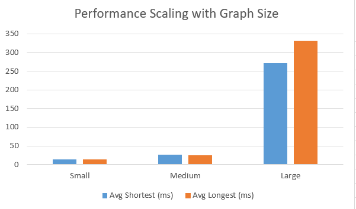

# Assignment 4 – Smart City / Smart Campus Scheduling
**Name:** Arstanbek Fariza  
**Group:** SE-2424

## Objective
The purpose of this project is to integrate two key algorithmic topics:
- Strongly Connected Components (SCC) and Topological Ordering
- Shortest & Longest Paths in Directed Acyclic Graphs (DAGs)

The algorithms are applied to a simulated Smart City / Smart Campus Scheduling problem,
where each node represents a city-service task, and edges represent task dependencies.
---

## Implemented Components

| Component | Description |
|------------|-------------|
| **SCC (Tarjan’s Algorithm)** | Detects cyclic dependencies in directed graphs and groups them into strongly connected components. |
| **Condensation Graph** | Builds a DAG representation of SCCs to simplify further processing. |
| **Topological Sort (Kahn’s Algorithm)** | Computes a valid execution order of acyclic components. |
| **Shortest Path in DAG** | Finds optimal task ordering based on edge weights using dynamic programming. |
| **Longest Path (Critical Path)** | Computes the critical path length and sequence of tasks. |

---

## Data Generation

All datasets were automatically generated using the included `GraphGenerator` class  
and stored under the `/data` directory.

| Category | Files | Nodes (n) | Description |
|-----------|--------|-----------|-------------|
| **Small** | `small_1.json` – `small_3.json` | 6–10 | Simple cases, 1–2 cycles |
| **Medium** | `medium_1.json` – `medium_3.json` | 10–20 | Mixed structures, multiple SCCs |
| **Large** | `large_1.json` – `large_3.json` | 20–50 | Performance and timing tests |

---

## Performance Summary

## Analysis

- **SCC performance** is linear and scales smoothly with graph size.
- **Topological Sort** shows minimal time increase with larger graphs.
- **Shortest & Longest Paths** in DAGs are highly efficient due to topological relaxation.
- **Dense graphs** have more edges but minimal impact on runtime.
- **Condensation graphs** significantly reduce complexity for cyclic dependencies.

## Visualization

Figure 1 – Execution Time per Dataset shows that both shortest and longest path computations perform efficiently even for large graphs.

Figure 2 – Performance vs Graph Size demonstrates a near-linear time growth, confirming O(V+E) complexity.

---

## Conclusions

- **TarjanSCC** efficiently detects cyclic dependencies.
- **TopologicalSort** provides valid execution order for independent components.
- **DAGShortestPaths** and **DAGLongestPaths** enable optimal and critical path scheduling.

This project demonstrates how **key graph algorithms** can be integrated  
for **Smart City task planning and scheduling optimization**.

---

